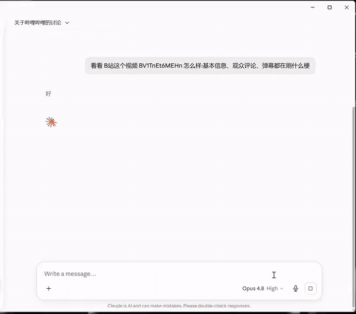

# bilibili-mcp

An MCP server that lets any AI client (Claude, Cursor, ...) read **public** Bilibili data: video info, subtitles, danmaku, and search. It's a thin wrapper over the mature [`bilibili-api`](https://github.com/Nemo2011/bilibili-api) library — all WBI signing, cookies, and anti-abuse handling are delegated to it.



> *Demo: from an AI client — search Bilibili, fetch video info, and analyze what viewers are spamming in the danmaku.*

> Reads public data only. Video info and search work as a guest (no login). Subtitles are gated behind login by Bilibili itself, so the subtitle tool needs your own SESSDATA cookie (see below). For personal/research use at a reasonable request rate.

## Tools

| Tool | Description |
| --- | --- |
| `get_video_info(bvid)` | Title, uploader, play/like/coin counts, duration, publish date, description. Accepts a BV id or a full video URL. **Guest, no login.** |
| `get_video_subtitle(bvid, lang="zh-CN", with_timestamp=False)` | Full subtitle/transcript text — great for "summarize this video". **Requires login** (`BILI_SESSDATA`, see below); returns clear guidance if no cookie is set, and a clear message when a video simply has no subtitles. |
| `get_video_danmaku(bvid, limit=200, with_timestamp=False)` | All danmaku (弹幕, on-screen bullet comments), ordered by appearance time — great for asking the AI what memes viewers spam, the overall mood, or which moments are "高能". **Guest, no login.** |
| `get_danmaku_hotwords(bvid, top=20, segments=5)` | Aggregates danmaku into a top repeated-comment ranking plus the highest-density "高能" time segments — a quick read on what viewers spam and which moments spike. **Guest, no login.** |
| `get_video_comments(bvid, sort="hot", limit=20)` | Top-level video comments (username, likes, content), sorted by likes (`hot`) or newest (`time`) — great for summarizing reception or finding debate. **Guest, no login.** |
| `search_videos(keyword, page=1, limit=10)` | Search videos by keyword. **Guest, no login.** |

## Install

The PyPI package is **`bilibili-data-mcp`** (the import module is `bilibili_mcp`).

### Option A — uvx (recommended, no clone, no manual venv)

If you have [uv](https://docs.astral.sh/uv/), just point your MCP client at the
package — `uvx` downloads it from PyPI, builds an isolated environment, and runs
it automatically:

```json
{
  "mcpServers": {
    "bilibili": {
      "command": "uvx",
      "args": ["bilibili-data-mcp"]
    }
  }
}
```

To pin a version, use `"args": ["bilibili-data-mcp@0.2.0"]`. The same config
works for any MCP client (Claude Desktop, Cursor, ...) via its
`claude_desktop_config.json` / equivalent.

### Option B — from source (development)

```
git clone https://github.com/haotongliu58-sudo/bilibili-mcp
cd bilibili-mcp
python -m venv .venv
.venv\Scripts\python.exe -m pip install -e .
```

Then point your MCP client at the built executable:

```json
{
  "mcpServers": {
    "bilibili": {
      "command": "C:\\path\\to\\bilibili-mcp\\.venv\\Scripts\\bilibili-data-mcp.exe"
    }
  }
}
```

## Subtitles & login (`BILI_SESSDATA`)

Bilibili restricts subtitle data to logged-in users, so `get_video_subtitle` needs **your own** `SESSDATA` cookie. Without it, info and search still work; the subtitle tool just returns a short note telling you to set the cookie.

To enable subtitles, get the `SESSDATA` value from your browser cookies on `bilibili.com` (DevTools → Application → Cookies) and pass it as an environment variable to the server:

```json
{
  "mcpServers": {
    "bilibili": {
      "command": "uvx",
      "args": ["bilibili-data-mcp"],
      "env": { "BILI_SESSDATA": "your_sessdata_value_here" }
    }
  }
}
```

The cookie is read locally and used only to call Bilibili's API directly from your machine — it is never uploaded anywhere. Optional companions (rarely needed for read-only subtitle access): `BILI_BILI_JCT`, `BILI_BUVID3`, `BILI_DEDEUSERID`.

## Proxy

By default the server **ignores the system proxy** and connects directly (Bilibili is a domestic CN site; routing through an overseas proxy node breaks requests). If you are outside mainland China and need a proxy to reach Bilibili, set `BILI_USE_PROXY=1` in the server's environment.

## License

MIT
